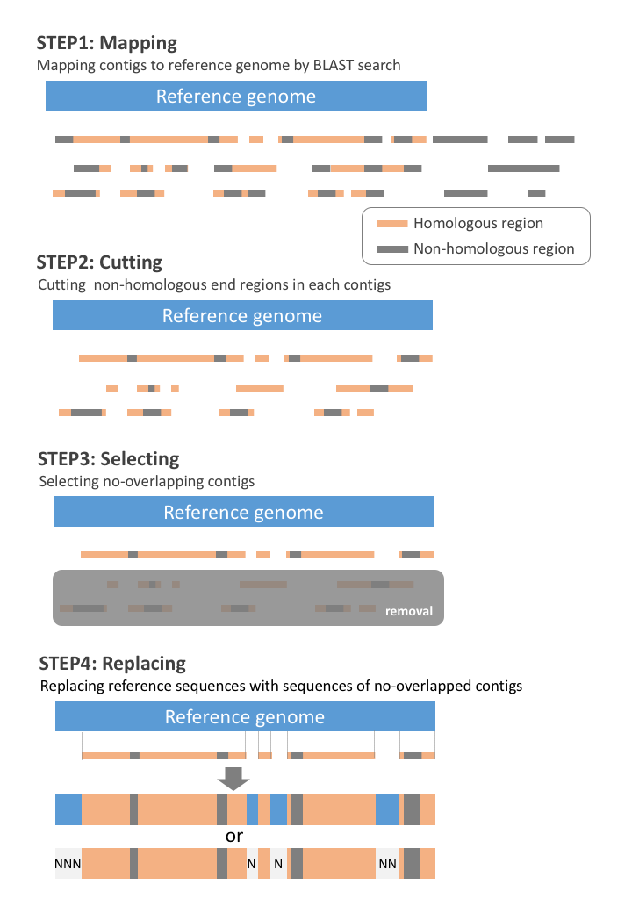

# Map-and-Rep for chloroplast genome

in development (version 0.0.1)

## Pipline workflow
- STEP1:
	- __Mapping__ contigs to complete genome sequences (reference) by BLAST search
- STEP2:
	- __Cutting__ non-homologous end regions in each contigs
- STEP3:
	- __Selecting__ no-overlapping contigs
- STEP4:
	- __Replacing__ reference sequences with sequences of no-overlapped contigs

## Requirements
- Python 3
	- Packages
		- numpy
		- pandas
		- Biopython
- NCBI BLAST+

## Input Data
- Contigs from Assembler (Multi-FASTA format)
- Complete chloroplast genome (Single-FASTA format)
